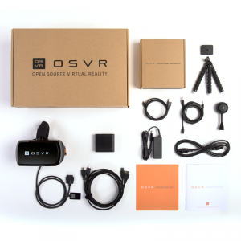

# OSVR-HDK-Info-from-Cool-Games

# OSVR HDK V1.3 - Notes on Start Up on multiple systems

> Maintained at <http://www.coolgames.net/OSVR_HDK>



> OSVR HDK V1.3 Specified at <http://www.razerzone.com/osvr-hacker-dev-kit>

## Project began December 25, 2015
After unpackaging and connecting to i5 13" MacBook Air with Belkin HDMI adapter


## Project update March 28, 2016

> Objective is to get a 3D application on portable battery powered system.

[Beagle Bone Black](https://github.com/CoolGames/OSVR-HDK-Info-from-Cool-Games/blob/master/Beagle%20Bone%20Black%20with%20OSVR%20HMD.md) or [Wifi Bluetooth Razer Forge TV](https://github.com/CoolGames/OSVR-HDK-Info-from-Cool-Games/blob/master/Beagle%20Bone%20Black%20with%20OSVR%20HMD.md) should be able to meet this objective.


> Belkin Adapter Specs at <http://www.belkin.com/us/F2CD079-Belkin/p/P-F2CD079;jsessionid=FC414A2C1175813017B9E6B935F28382/>

## I am on Ubuntu Studio 15.10 and so I read 
> <https://github.com/OSVR/OSVR-Docs/blob/master/Getting-Started/Installing/linux.md>
and paid attension to
> <https://github.com/OSVR/OSVR-Core/wiki/Linux-Build-Instructions#known-issues-temporary>

### and tried SOLUTION AT [Issue #338](https://github.com/OSVR/OSVR-Core/issues/338) since I don't get the message
=======
I am on Ubuntu and read
> <https://github.com/OSVR/OSVR-Core/wiki/Linux-Build-Instructions#known-issues-temporary>

 and
tried #338 since I don't get a message
>>>>>>> 00f65308ff988a325a08cb41c529f5d826138005

 `Added device: com_osvr_Multiserver/OSVRHackerDevKit0`
  when I start the osvr_server on HDK V1.3.
I did create the udev rule at 
> </etc/udv/rules.d/99-sensics-usb.rules>
 from
 > <https://gist.github.com/rpavlik/98d21e14a7e6eeb52e95>

I am making notes and assume I do a

` sudo make install`

after the make -j4
For the record I also had to move server for SteamVR:

```
mkdir -p ~/.steam/steam/steamapps/common/SteamVR/drivers/osvr/bin/linux64
```

then

```
cp /usr/local/drivers/osvr/bin/linux64/driver_osvr.so ~/.steam/steam/steamapps/common/SteamVR/drivers/osvr/bin/linux64/
```

